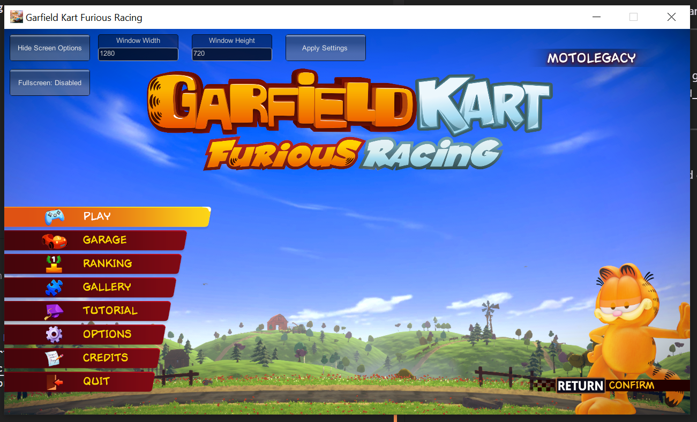

# Furious-Resolution-Patch

## About
The Furious-Resolution-Patch is a BepInEx Plugin Designed to add Resolution and Fullscreen options to Garfield Kart: Furious Racing (https://store.steampowered.com/app/1085510/Garfield_Kart__Furious_Racing/). It is very generic, using only the basic Unity GUI Elements and API, so it will probably work on other games if applicable.

## Usage
After plugin initialization, the mouse cursor will become visible and a new button, `Show Screen Options`, will appear. Click the button to Display the Fullscreen Toggle and Window dimension settings. Adjust it to your liking and press `Apply Settings` for changes to take effect.

## Installation
The plugin requires [BepInEx](https://github.com/BepInEx/BepInEx) to be installed in the game's root directory, instructions to do so can be found on the BepInEx README. Once Installed, place `garfield_res.dll` into `<Game Root>/BepInEx/plugins/`. Once the game has launched, the plugin will initialize.

## Building from Source
Building requires the [.NET SDK](https://dotnet.microsoft.com/download) (5.0 or Newer) and can only be built on Windows systems. The following DLLS must be placed in the `lib` directory:

From BepInEx:
<ul>
    <li>0Harmony.dll</li>
    <li>BepInEx.dll</li>
    <li>BepInEx.Harmony.dll</li>
</ul>

From Garfield Kart: Furious Racing:
<ul>
    <li>Assembly-CSharp.dll</li>
    <li>UnityEngine.CoreModule.dll</li>
    <li>UnityEngine.dll</li>
    <li>UnityEngine.IMGUIModule.dll</li>
    <li>UnityEngine.UI.dll</li>
</ul>

Once placed, simply run `dotnet build` in the root source directory to have the .DLL built to /bin/Debug/net48/.